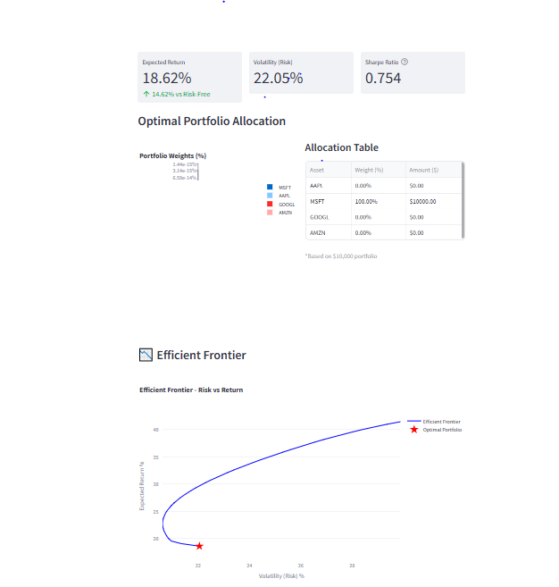
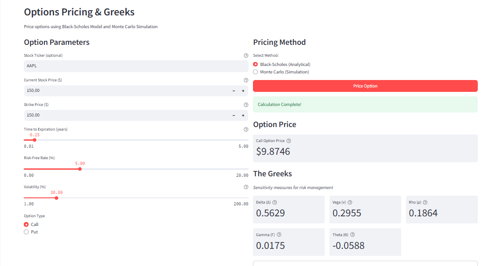
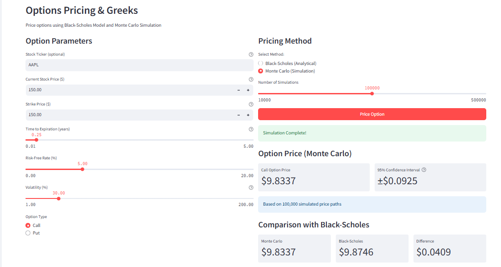

#  AlphaOPT

A comprehensive Python-based portfolio optimization and options pricing platform with production-grade REST API, real-time market data integration, and interactive visualizations.

[](https://www.python.org/downloads/)
[](https://fastapi.tiangolo.com/)
[](https://streamlit.io/)
[](https://www.docker.com/)
[](LICENSE)

🌐 **Live API:** [https://alpha-opt.onrender.com](https://alpha-opt.onrender.com/docs)

---

##  Features

### 🚀 Production REST API
- **FastAPI** with auto-generated documentation
- Sub-200ms response times for standard requests
- Docker containerized deployment
- MLflow experiment tracking (development)
- Comprehensive test suite (10/10 passing)
- Live deployment on Render with auto-scaling

### 📊 Portfolio Optimization
- **Mean-Variance Optimization** based on Modern Portfolio Theory (Markowitz, 1952)
- Interactive efficient frontier visualization
- Sharpe ratio maximization
- Customizable constraints and target returns
- Real-time portfolio rebalancing calculations

### 💹 Options Pricing
- **Black-Scholes Model** for European options
- Complete Greeks calculation (Delta, Gamma, Vega, Theta, Rho)
- **Monte Carlo simulation** for exotic derivatives
- Side-by-side pricing comparison
- Interactive parameter adjustments

### 📈 Market Data Analysis
- Real-time data integration via Yahoo Finance
- Historical price charts and trend analysis
- Returns distribution and volatility calculations
- Multi-asset correlation analysis

---

##  Quick Start

### 🌐 Use the Live API (No Installation Required)

**API Documentation:** [https://alpha-opt.onrender.com/docs](https://alpha-opt.onrender.com/docs)

```bash
# Portfolio Optimization
curl -X POST https://alpha-opt.onrender.com/api/v1/optimize-portfolio \
  -H "Content-Type: application/json" \
  -d '{
    "tickers": ["AAPL", "MSFT", "GOOGL", "AMZN"],
    "target_return": 0.12,
    "risk_tolerance": "moderate",
    "period": "5y"
  }'

# Options Pricing
curl -X POST https://alpha-opt.onrender.com/api/v1/price-option \
  -H "Content-Type: application/json" \
  -d '{
    "spot_price": 100,
    "strike_price": 105,
    "time_to_maturity": 1.0,
    "risk_free_rate": 0.05,
    "volatility": 0.20,
    "option_type": "call",
    "method": "black-scholes"
  }'
```

### 💻 Local Installation

#### Prerequisites
- Python 3.9 or higher
- Docker (optional, for containerized deployment)
- pip package manager

#### Installation
```bash
# Clone the repository
git clone https://github.com/lawren-ai/alpha-opt.git
cd alpha-opt

# Create and activate virtual environment
python -m venv venv

# On macOS/Linux:
source venv/bin/activate

# On Windows:
venv\Scripts\activate

# Install dependencies
pip install -r requirements.txt
```

#### Run the Streamlit Dashboard
```bash
streamlit run app.py
```

The dashboard will open at `http://localhost:8501`

#### Run the REST API
```bash
# Option 1: Direct with uvicorn
uvicorn main:app --reload --host 0.0.0.0 --port 8000

# Option 2: With Docker Compose (includes MLflow)
docker-compose up -d

# Access:
# - API: http://localhost:8000/docs
# - MLflow: http://localhost:5000
```

---

##  API Reference

### Base URL
- **Production:** `https://alpha-opt.onrender.com`
- **Local:** `http://localhost:8000`

### Endpoints

#### 1. Portfolio Optimization
```http
POST /api/v1/optimize-portfolio
```

**Request Body:**
```json
{
  "tickers": ["AAPL", "MSFT", "GOOGL", "AMZN"],
  "target_return": 0.12,
  "risk_tolerance": "moderate",
  "period": "5y",
  "max_weight": 0.40,
  "min_weight": 0.05
}
```

**Response:**
```json
{
  "weights": {
    "AAPL": 0.28,
    "MSFT": 0.35,
    "GOOGL": 0.20,
    "AMZN": 0.17
  },
  "expected_return": 0.125,
  "volatility": 0.182,
  "sharpe_ratio": 0.577,
  "concentration_hhi": 0.268,
  "computation_time_ms": 156.3
}
```

#### 2. Options Pricing
```http
POST /api/v1/price-option
```

**Request Body:**
```json
{
  "spot_price": 100.0,
  "strike_price": 105.0,
  "time_to_maturity": 1.0,
  "risk_free_rate": 0.05,
  "volatility": 0.20,
  "option_type": "call",
  "method": "black-scholes"
}
```

**Response:**
```json
{
  "option_price": 8.9157,
  "greeks": {
    "delta": 0.5596,
    "gamma": 0.0183,
    "theta": -0.0112,
    "vega": 0.3651,
    "rho": 0.5291
  },
  "method": "black-scholes",
  "intrinsic_value": 0.0,
  "time_value": 8.9157,
  "computation_time_ms": 2.1
}
```

#### 3. Strategy Backtesting
```http
POST /api/v1/backtest-strategy
```

**Request Body:**
```json
{
  "tickers": ["AAPL", "MSFT", "GOOGL"],
  "strategy": "max-sharpe",
  "start_date": "2020-01-01",
  "end_date": "2023-12-31",
  "rebalance_frequency": "monthly",
  "initial_capital": 10000.0
}
```

**Response:**
```json
{
  "total_return": 0.452,
  "annualized_return": 0.121,
  "volatility": 0.185,
  "sharpe_ratio": 0.546,
  "max_drawdown": 0.187,
  "win_rate": 0.583,
  "num_trades": 47,
  "final_portfolio_value": 14520.0
}
```

---

## 💻 Usage Examples

### Python Client

```python
import requests

# Portfolio Optimization
response = requests.post(
    "https://alpha-opt.onrender.com/api/v1/optimize-portfolio",
    json={
        "tickers": ["AAPL", "MSFT", "GOOGL"],
        "target_return": 0.12,
        "risk_tolerance": "moderate"
    }
)

result = response.json()
print(f"Optimal Weights: {result['weights']}")
print(f"Sharpe Ratio: {result['sharpe_ratio']:.3f}")
```


### Local Python Library

```python
from src.portfolio.optimizer import PortfolioOptimizer
from src.utils.data_loader import DataLoader

# Fetch market data
loader = DataLoader()
data = loader.fetch_data(['AAPL', 'MSFT', 'GOOGL', 'AMZN'], period='5y')
returns = loader.calculate_returns()

# Optimize portfolio
optimizer = PortfolioOptimizer(returns)
result = optimizer.max_sharpe_portfolio()

print(f"Expected Return: {result['return']:.2%}")
print(f"Volatility: {result['volatility']:.2%}")
print(f"Sharpe Ratio: {result['sharpe_ratio']:.2f}")
```

### Black-Scholes Options Pricing

```python
from src.options.black_scholes import BlackScholesModel

# Initialize model
bs = BlackScholesModel(
    S=150,      # Current stock price
    K=150,      # Strike price
    T=0.25,     # Time to expiration (years)
    r=0.05,     # Risk-free rate
    sigma=0.30  # Volatility
)

# Calculate option price and Greeks
greeks = bs.all_greeks('call')

print(f"Call Option Price: ${greeks['price']:.2f}")
print(f"Delta: {greeks['delta']:.4f}")
print(f"Gamma: {greeks['gamma']:.4f}")
print(f"Vega: {greeks['vega']:.4f}")
```

### Monte Carlo Simulation

```python
from src.options.monte_carlo import MonteCarloSimulator

# Run simulation
mc = MonteCarloSimulator(
    S0=150, K=150, T=0.25, 
    r=0.05, sigma=0.30,
    n_simulations=100000
)

result = mc.price_european_option('call')
print(f"Option Price: ${result['price']:.2f}")
print(f"Std Error: ${result['std_error']:.4f}")
print(f"95% CI: [${result['conf_lower']:.2f}, ${result['conf_upper']:.2f}]")
```

---

##  Project Structure

```
alpha-opt/
├── main.py                           # FastAPI application
├── app.py                            # Streamlit dashboard
├── Dockerfile                        # Docker configuration
├── docker-compose.yml                # Multi-service orchestration
├── requirements.txt                  # Python dependencies
├── src/
│   ├── portfolio/
│   │   ├── __init__.py
│   │   └── optimizer.py              # Mean-variance optimization
│   ├── options/
│   │   ├── __init__.py
│   │   ├── black_scholes.py          # Analytical pricing model
│   │   └── monte_carlo.py            # Numerical simulation
│   └── utils/
│       ├── __init__.py
│       └── data_loader.py            # Market data fetching
├── tests/
│   ├── test_api.py                   # API integration tests
│   ├── test_portfolio.py             # Portfolio tests
│   └── test_options.py               # Options pricing tests
└── screenshots/                      # Demo images
```

---

##  Tech Stack

| Technology | Purpose |
|------------|---------|
| **Python 3.9+** | Core programming language |
| **FastAPI** | Production REST API framework |
| **NumPy** | Numerical computations and array operations |
| **Pandas** | Data manipulation and time series |
| **SciPy** | Convex optimization and statistical computing |
| **Streamlit** | Interactive web dashboard |
| **Plotly** | Dynamic visualizations |
| **yfinance** | Real-time market data API |
| **Docker** | Containerization and deployment |
| **MLflow** | Experiment tracking (development) |
| **pytest** | Testing framework |

---

##  Theory & Mathematics

### Modern Portfolio Theory
Implementation of Harry Markowitz's mean-variance framework:

**Optimization Problem:**
```
minimize:    (1/2) * w^T * Σ * w
subject to:  w^T * μ = r_target
             w^T * 1 = 1
             w ≥ 0
```

Where:
- `w` = portfolio weights
- `Σ` = covariance matrix
- `μ` = expected returns vector
- `r_target` = target return

### Black-Scholes Model
Closed-form solution for European options:

**Call Option Price:**
```
C = S*N(d₁) - K*e^(-rT)*N(d₂)

where:
d₁ = [ln(S/K) + (r + σ²/2)T] / (σ√T)
d₂ = d₁ - σ√T
```

**Greeks:**
- **Delta (Δ)**: ∂V/∂S - Price sensitivity to underlying
- **Gamma (Γ)**: ∂²V/∂S² - Delta sensitivity
- **Vega (ν)**: ∂V/∂σ - Volatility sensitivity
- **Theta (Θ)**: ∂V/∂t - Time decay
- **Rho (ρ)**: ∂V/∂r - Interest rate sensitivity

### Monte Carlo Simulation
Simulates stock price paths using Geometric Brownian Motion:
```
S(t+Δt) = S(t) * exp((r - σ²/2)Δt + σ√Δt*Z)
```

Where Z ~ N(0,1)

---

##  Testing

```bash
# Run all tests
pytest tests/ -v

# Run specific test file
pytest tests/test_api.py -v

# Run with coverage
pytest tests/ --cov=. --cov-report=html

# Results: 10/10 tests passing ✅
```

---

##  Deployment

### Docker

```bash
# Build and run
docker-compose up --build -d

# Access services
# API: http://localhost:8000/docs
# MLflow: http://localhost:5000

# Stop services
docker-compose down
```

### Production (Render)

The API is automatically deployed to Render on every push to `main` branch.

**Live URL:** https://alpha-opt.onrender.com

**Architecture:**
- **Development:** Docker Compose + MLflow tracking
- **Production:** Render.com with auto-scaling
- **CI/CD:** GitHub → Render auto-deployment

---


---

##  Screenshots
### Portfolio Optimizer Dashboard

*Interactive portfolio optimization with efficient frontier visualization*

### Options Pricer

*Real-time options pricing with Greeks analysis*

### Monte Carlo Simulation

*Numerical computation with Black-Scholes comparison*

### Live Demo

*Live Demonstration*

---

##  Future Enhancements

- [ ] American options pricing using binomial tree model
- [ ] Implied volatility surface calibration
- [ ] Value at Risk (VaR) and Conditional VaR calculations
- [ ] Real-time WebSocket feed for live market data
- [ ] Machine learning for return prediction
- [ ] Multi-factor risk models (Fama-French)
- [ ] Backtesting framework with transaction costs
- [ ] Authentication and API rate limiting
- [ ] PostgreSQL for persistent storage
- [ ] Kubernetes deployment configuration

---

##  Known Issues & Limitations

- **Free tier limitations:** Render free tier spins down after 15 minutes of inactivity
- **Yahoo Finance:** API may occasionally rate-limit requests (retry logic implemented)
- **Black-Scholes assumptions:** Constant volatility and no dividends (real markets violate these)
- **Historical data:** Limited to publicly available tickers

---

##  Contributing

Contributions, issues, and feature requests are welcome!

1. Fork the repository
2. Create a feature branch (`git checkout -b feature/AmazingFeature`)
3. Commit your changes (`git commit -m 'Add some AmazingFeature'`)
4. Push to the branch (`git push origin feature/AmazingFeature`)
5. Open a Pull Request

---

##  License

This project is licensed under the MIT License - see the [LICENSE](LICENSE) file for details.

---

##  Acknowledgments

- **Modern Portfolio Theory** - Harry Markowitz (1952)
- **Black-Scholes-Merton Model** - Fischer Black, Myron Scholes, Robert Merton (1973)
- Market data provided by **Yahoo Finance**
- Built with **FastAPI** and **Streamlit** frameworks
- Deployed on **Render**

---

##  Author

**Ayotunde Akinboade**
- GitHub: [@lawren-ai](https://github.com/lawren-ai)
- LinkedIn: [Ayotunde Akinboade](https://linkedin.com/in/ayotunde-akinboade)
- Live API: [alpha-opt.onrender.com](https://alpha-opt.onrender.com/docs)


